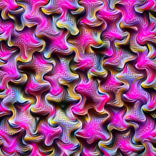

# VisionLens

`visionlens` is a Python package for visualizing and analyzing deep learning models. It can be used to visualize model's layer, channel, or neuron activations. I created this package to help me understand how deep learning models work and to debug my models. Most of the work is taken or inspired by the [lucent](https://github.com/greentfrapp/lucent/tree/dev) (which is a PyTorch port of the original [Lucid](https://github.com/tensorflow/lucid)).

## Usage

```python
# import the main class which helps to visualize the model and do all the optimization and plot
from visionlens.optimize import Visualizer

# import the model, can be any model from torchvision.models or any custom model
from visionlens.models import inception_v1

# load the model in eval mode
model = inception_v1(pretrained=True).eval()

# create the visualizer object
viz = Visualizer(model, objective_f="mixed4a:97")
images = viz.visualize(lr=0.05, freq=10, threshold=(512, 1024, 2048), show_last=True)
```

- Here a random image will be optimized to maximize the activation of the `mixed4a:97` channel of the model. `threshold` is the steps at which the image will be saved. `freq` is the frequency at which the image will be displayed. `lr` is the learning rate of the optimization. `show_last` is the flag to show the last image after the optimization is done. For the above example, the output will be like this:


### More Control over Objective Function

- To create different objective functions, you can use the `Objective` class. Here is an example:

```python
from visionlens.objectives import Objective

# create the objective function
obj1 = Objective.create_objective("mixed4a:97")
obj2 = Objective.create_objective("mixed4a:180")
obj = obj1 + obj2

# create the visualizer object
viz = Visualizer(model, objective_f=obj)
images = viz.visualize(lr=0.05, freq=10, threshold=(512, 1024, 2048), show_last=True)
```

- Here the objective function is the sum of the activations of the `mixed4a:97` and `mixed4a:180` channels. The output will be like this:



- You can also create a custom objective by using the `Objective` class. It must take the layer as an input and return the activation of that layer. Here is an example:

```python
from visionlens.objectives import MultiHook

hooks = MultiHook(model, ["mixed4a"])

def custom_objective_f(hooks):
    return -hooks("mixed4a")[:, 97, 5, 7].mean()

viz = Visualizer(model, objective_f=custom_objective_f, model_hooks=hooks)
images = viz.visualize(lr=0.05, freq=10, threshold=(512,), show_last=True)
```

- Here, first we added the hooks at the `mixed4a` layer. Then we created a custom objective function which takes the hooks as input and returns the activation of a number of mixed4a layer channel 97, at position (5, 7). The output will be like this:


### Positive and Negative Optimization

```python
from visionlens.display_img_utils import display_images_in_table
from visionlens.images import get_images

obj1 = Objective.create_objective("mixed4a:41", batch=0)
obj2 = -Objective.create_objective("mixed4a:41", batch=1)
obj = obj1 + obj2

img_f = lambda: get_images(w=224, batch=2)

viz = Visualizer(model, objective_f=obj, param_f=img_f)
images = viz.visualize(lr=0.05, freq=10, threshold=(512,), show_last=True)

display_images_in_table(images[0], ["Positive", "Negative"])
```
- Here we are optimizing the image to maximize the activation of the `mixed4a:41` channel of the model for the first image and minimize the activation of the `mixed4a:41` channel of the model for the second image. The output will be like this:

<div style="display: flex; justify-content: space-around;">
  <div style="text-align: center;">
    
    <p>Positive</p>
  </div>
  <div style="text-align: center;">
    
    <p>Negative</p>
  </div>
</div>